# Тестування працездатності системи

Тестування проводиться за допомогою web-версії утиліти Postman.

## Запуск сервісу
_Для запуску налаштований спеціальний скрипт в package.json._
___
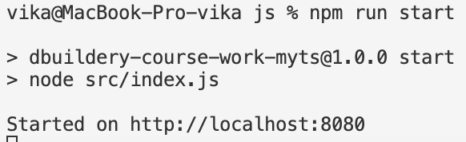
___

## Відображення усіх сутностей
_Тестування проводиться на базі даних з пустою таблицею Task._

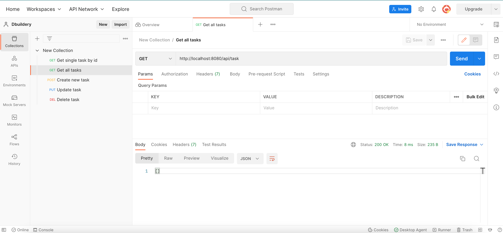

## Додавання сутності

_Видається помилка, якщо одне з потрібних полей не вказано._

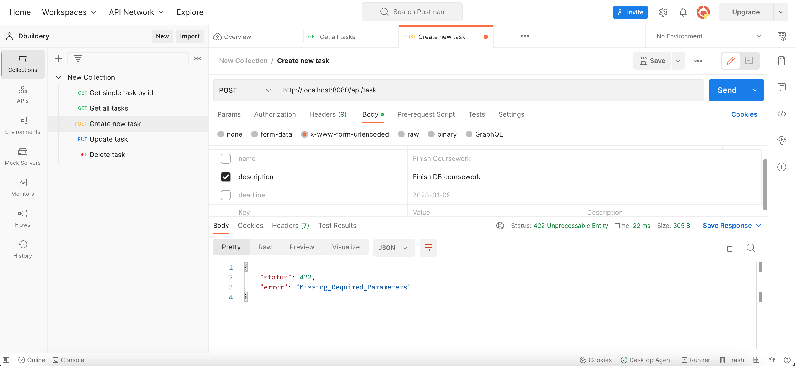

_Поле "deadline" необов'язкове._

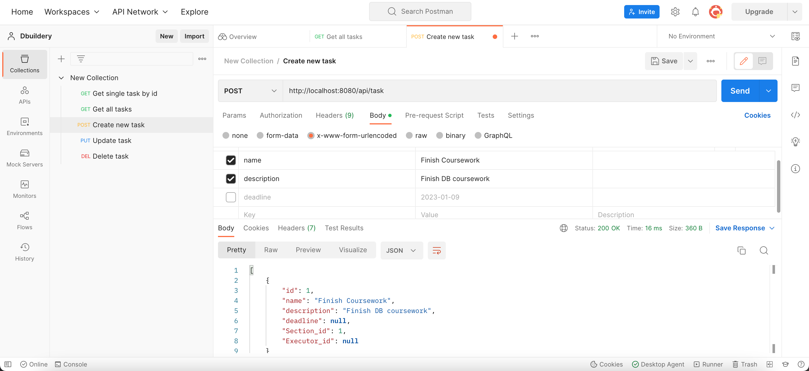

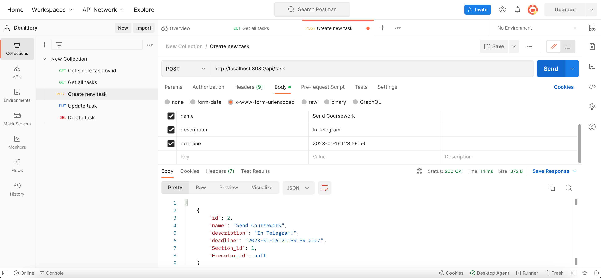

_Результат:_

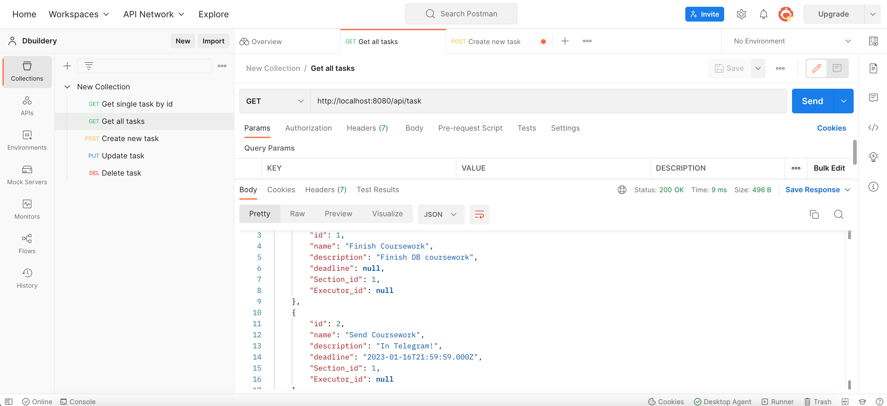

## Зчитування сутності за ID

_Видається помилка, якщо такої сутності не існує._

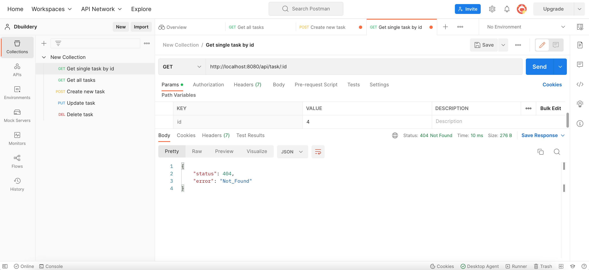

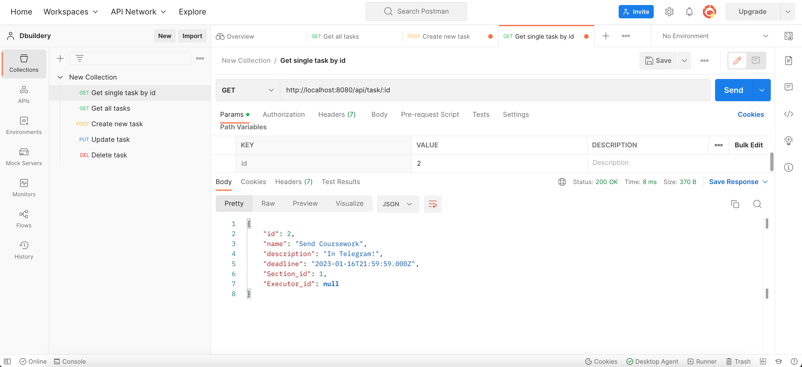

## Оновлення сутності за ID

_Видається помилка, якщо такої сутності не існує._

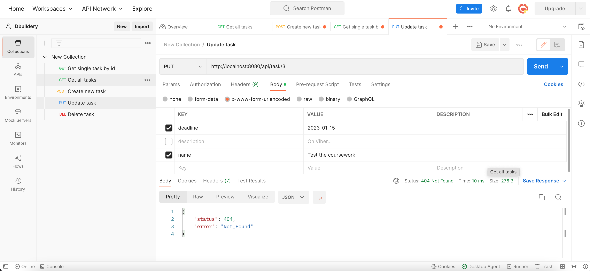

_Ніяке з полів body не є обов'язковим._

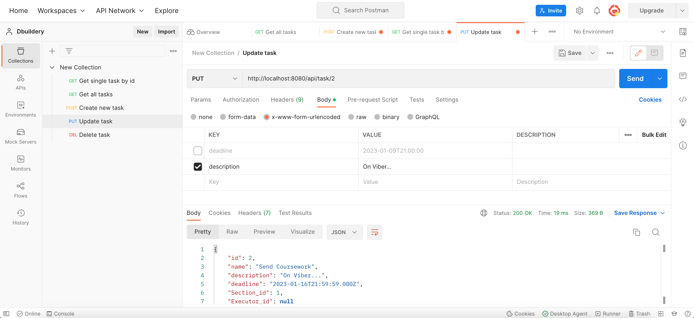

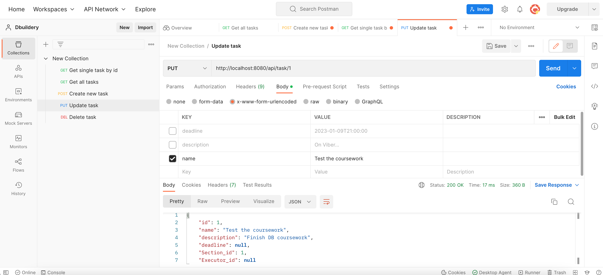

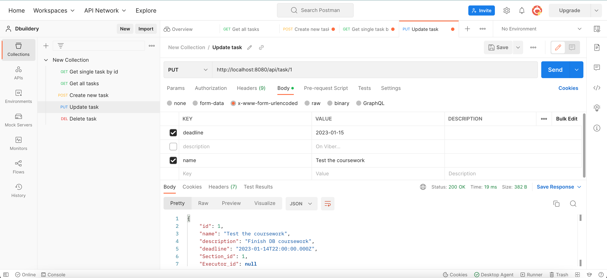

_Результат:_

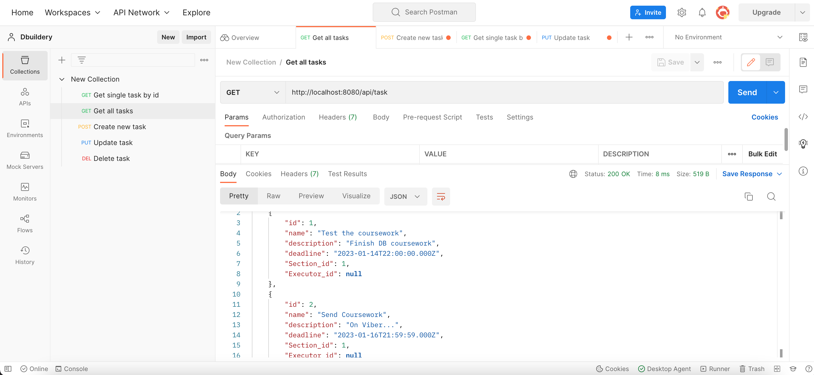

## Видалення сутності за ID

_Видається помилка, якщо такої сутності не існує._

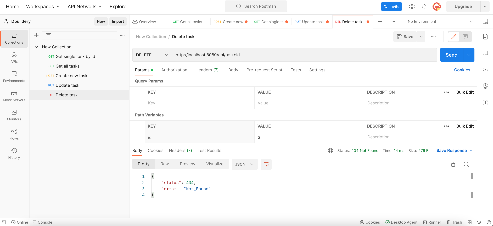

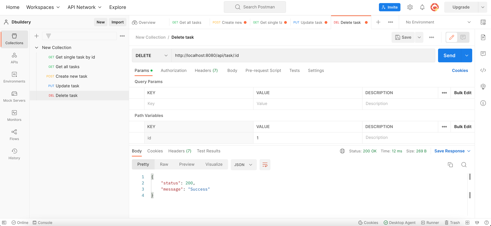

_Результат:_

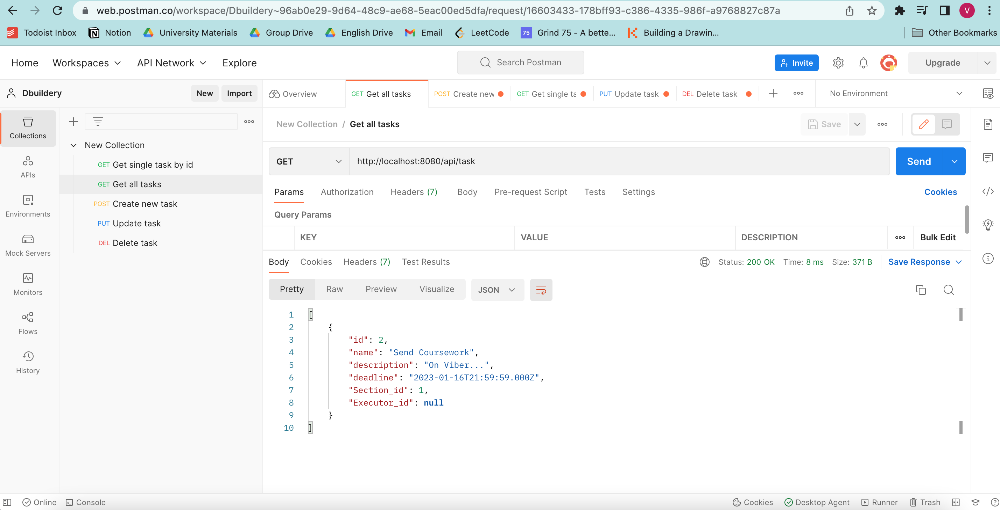